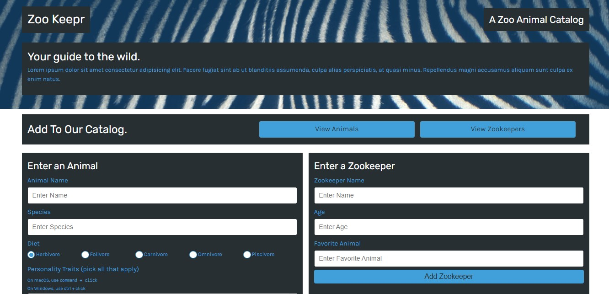

# Zookeepr

### Description
This full stack web appliction, using animal and zookeeper json files for the database, is a central location for where a zoo can dynamically add new zookeepers or animals. As well as view the current zookeepers and animals.

### License

This application is licensed under MIT

### Application Demo

### Table of Contents
- [Description](#description)
- [Contributing](#contributing)
- [Tests](#tests)
- [Questions?](#questions)

### Contributing
No contributions at this time.

### Tests
Zookeepers: creates a zookeeper object, filters by query, finds by id, validates age.

Animals: creates an animal object, filters by query, finds by id, validates personality traits.

### Questions
GitHub Username: (kcaseychamberlain) 

View the project in GitHub at: https://github.com/KCaseyChamberlain/u-develop-it

View the application live hosted at: https://powerful-plateau-87104.herokuapp.com/

If you have any questions, contact Casey at: caseygchamberlain@gmail.com